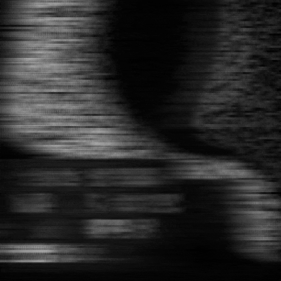
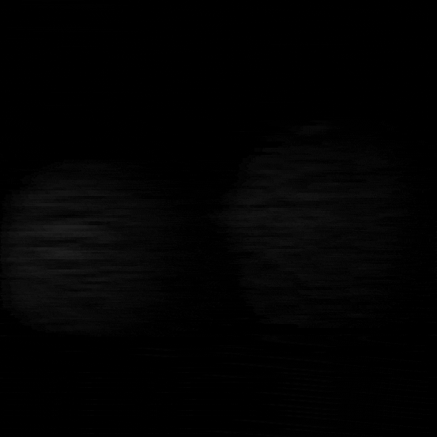
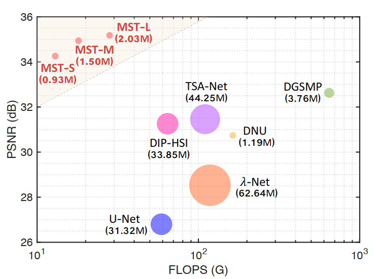
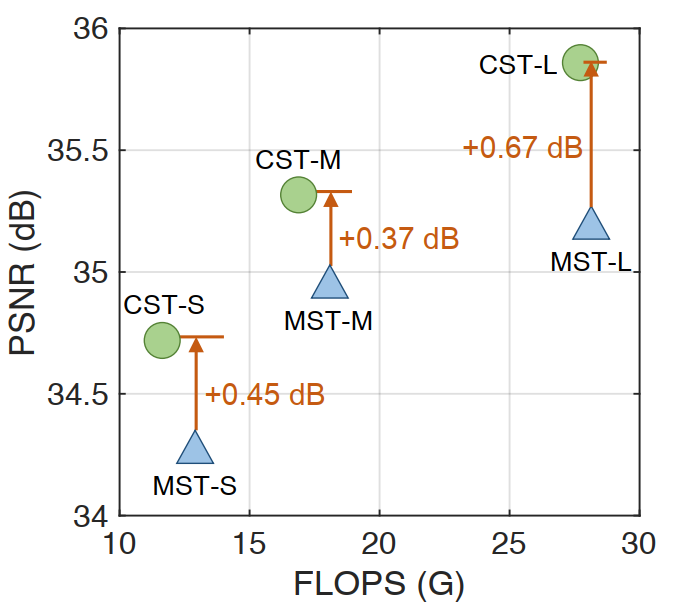
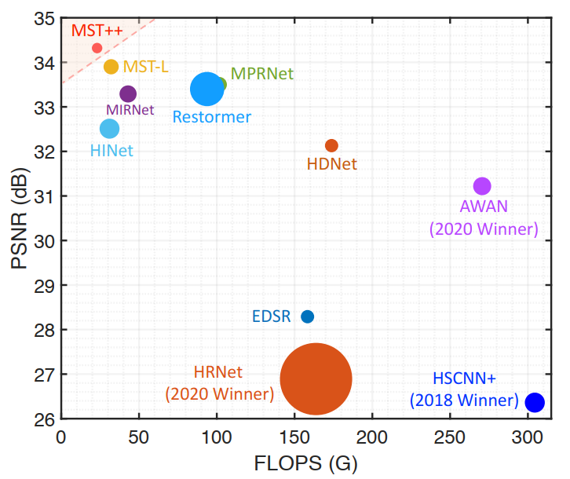
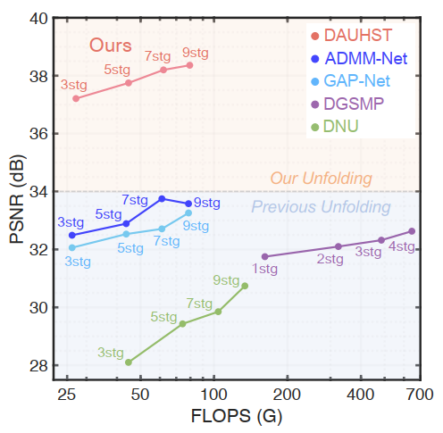
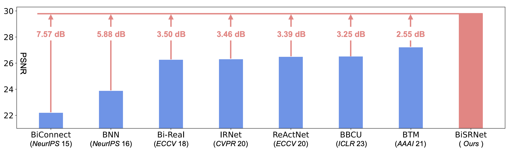

[](https://paperswithcode.com/sota/spectral-reconstruction-on-arad-1k?p=mst-multi-stage-spectral-wise-transformer-for)
[](https://paperswithcode.com/sota/spectral-reconstruction-on-cave?p=degradation-aware-unfolding-half-shuffle)

[](https://paperswithcode.com/sota/spectral-reconstruction-on-kaist?p=degradation-aware-unfolding-half-shuffle)
[](https://paperswithcode.com/sota/spectral-reconstruction-on-real-hsi?p=degradation-aware-unfolding-half-shuffle)


# A Toolbox for Spectral Compressive Imaging
[](https://github.com/caiyuanhao1998/MST-plus-plus/)
[](https://zhuanlan.zhihu.com/p/501101943)
[](https://zhuanlan.zhihu.com/p/544979161)
[](https://zhuanlan.zhihu.com/p/576280023)

#### Authors
Yuanhao Cai*, Jing Lin*, Xiaowan Hu, Haoqian Wang, Xin Yuan, Yulun Zhang, Radu Timofte, and Luc Van Gool

#### Papers
- [Binarized Spectral Compressive Imaging (NeurIPS 2023)](https://arxiv.org/abs/2305.10299)
- [Mask-guided Spectral-wise Transformer for Efficient Hyperspectral Image Reconstruction (CVPR 2022)](https://arxiv.org/abs/2111.07910)
- [Coarse-to-Fine Sparse Transformer for Hyperspectral Image Reconstruction (ECCV 2022)](https://arxiv.org/abs/2203.04845)
- [Degradation-Aware Unfolding Half-Shuffle Transformer for Spectral Compressive Imaging (NeurIPS 2022)](https://arxiv.org/abs/2205.10102)
- [MST++: Multi-stage Spectral-wise Transformer for Efficient Spectral Reconstruction (CVPRW 2022)](https://arxiv.org/abs/2111.07910)
- [HDNet: High-resolution Dual-domain Learning for Spectral Compressive Imaging (CVPR 2022)](https://arxiv.org/abs/2203.02149)


#### Awards


#### News
- **2023.12.02 :** Codes for real experiments have been updated. Welcome to check and use them. 🥳
- **2023.11.24 :** Code, models, and results of [BiSRNet](https://arxiv.org/pdf/2305.10299.pdf) (NeurIPS 2023) are released at this repo. We also develop a toolbox [BiSCI](https://github.com/caiyuanhao1998/BiSCI) for binarized SCI reconstruction. Feel free to check and use them. 🌟
- **2023.11.02 :** MST, MST++, CST, and DAUHST are added to the [Awesome-Transformer-Attention](https://github.com/cmhungsteve/Awesome-Transformer-Attention/blob/main/README_2.md#image-restoration) collection. 💫
- **2023.09.21 :** Our new work [BiSRNet](https://arxiv.org/pdf/2305.10299.pdf) is accepted by NeurIPS 23. Code will be released at this repo and [BiSCI](https://github.com/caiyuanhao1998/BiSCI)
- **2023.02.26 :** We release the RGB images of [five real scenes](https://drive.google.com/drive/folders/1VTMgEbfX9MVpGo98XVVFKaANtQfgApAg?usp=sharing) and [ten simulation scenes](https://drive.google.com/drive/folders/1EkJsOxYKgyehZdOgKUeY75dU19GHZgE-?usp=sharing). Please feel free to check and use them. 🌟
- **2022.11.02 :** We have provided more visual results of state-of-the-art methods and the function to evaluate the parameters and computational complexity of models. Please feel free to check and use them. :high_brightness:
- **2022.10.23 :** Code, models, and reconstructed HSI results of [DAUHST](https://arxiv.org/abs/2205.10102) have been released. 🔥
- **2022.09.15 :** Our [DAUHST](https://arxiv.org/abs/2205.10102) has been accepted by NeurIPS 2022, code and models are coming soon. :rocket:
- **2022.07.20 :** Code, models, and reconstructed HSI results of [CST](https://arxiv.org/abs/2203.04845) have been released. 🔥
- **2022.07.04 :** Our paper [CST](https://arxiv.org/abs/2203.04845) has been accepted by ECCV 2022, code and models are coming soon. :rocket:
- **2022.06.14 :** Code and models of [MST](https://arxiv.org/abs/2111.07910) and [MST++](https://arxiv.org/abs/2111.07910) have been released. This repo supports 12 learning-based methods to serve as toolbox for Spectral Compressive Imaging. The model zoo will be enlarged. 🔥
- **2022.05.20 :** Our work [DAUHST](https://arxiv.org/abs/2205.10102) is on arxiv. :dizzy:
- **2022.04.02 :** Further work [MST++](https://github.com/caiyuanhao1998/MST-plus-plus/) has won the NTIRE 2022 Spectral Reconstruction Challenge. :trophy: 
- **2022.03.09 :** Our work [CST](https://arxiv.org/abs/2203.04845) is on arxiv. :dizzy:
- **2022.03.02 :** Our paper MST has been accepted by CVPR 2022, code and models are coming soon. :rocket: 

|                          *Scene 2*                           |                          *Scene 3*                           |                          *Scene 4*                           |                          *Scene 7*                           |
| :----------------------------------------------------------: | :----------------------------------------------------------: | :----------------------------------------------------------: | :----------------------------------------------------------: |
|  |  |  |  |


&nbsp;


## 1. Comparison with State-of-the-art Methods
This repo is a baseline and toolbox containing 12 learning-based algorithms for spectral compressive imaging.

<details open>
<summary><b>Supported algorithms:</b></summary>

* [x] [MST](https://arxiv.org/abs/2111.07910) (CVPR 2022)
* [x] [CST](https://arxiv.org/abs/2203.04845) (ECCV 2022)
* [x] [DAUHST](https://arxiv.org/abs/2205.10102) (NeurIPS 2022)
* [x] [BiSRNet](https://arxiv.org/abs/2305.10299) (NeurIPS 2023)
* [x] [MST++](https://arxiv.org/abs/2111.07910) (CVPRW 2022)
* [x] [HDNet](https://arxiv.org/abs/2203.02149) (CVPR 2022)
* [x] [BIRNAT](https://ieeexplore.ieee.org/abstract/document/9741335/) (TPAMI 2022)
* [x] [DGSMP](https://arxiv.org/abs/2103.07152) (CVPR 2021)
* [x] [GAP-Net](https://arxiv.org/abs/2012.08364) (Arxiv 2020)
* [x] [TSA-Net](https://link.springer.com/chapter/10.1007/978-3-030-58592-1_12) (ECCV 2020)
* [x] [ADMM-Net](https://openaccess.thecvf.com/content_ICCV_2019/html/Ma_Deep_Tensor_ADMM-Net_for_Snapshot_Compressive_Imaging_ICCV_2019_paper.html) (ICCV 2019)
* [x] [λ-Net](https://ieeexplore.ieee.org/document/9010044) (ICCV 2019)


</details>

We are going to enlarge our model zoo in the future.

|                   MST vs. SOTA                   |                 CST vs. MST                 |
| :----------------------------------------------: | :-----------------------------------------: |
|  |  |
|                  MST++ vs. SOTA                  |               DAUHST vs. SOTA               |
|       |   |

|                  BiSRNet vs. SOTA BNNs           |
| :----------------------------------------------: |
|  |


### Quantitative Comparison on Simulation Dataset

|                            Method                            | Params (M) | FLOPS (G) | PSNR  | SSIM  |                          Model Zoo                           |                      Simulation  Result                      |                         Real  Result                         |
| :----------------------------------------------------------: | :--------: | :-------: | :---: | :---: | :----------------------------------------------------------: | :----------------------------------------------------------: | :----------------------------------------------------------: |
|    [λ-Net](https://ieeexplore.ieee.org/document/9010044)     |   62.64    |  117.98   | 28.53 | 0.841 | [Google Drive](https://drive.google.com/drive/folders/11DwTFdgtG7sRnBwvkxxfN9rcOICsEdpC?usp=sharing) / [Baidu Disk](https://pan.baidu.com/s/1xXkL2p4_mCLeTGa68wEbNQ?pwd=mst1) | [Google Drive](https://drive.google.com/drive/folders/1csOZ2Kfto_tWIiSD0hc2nzKjR4Ze7ftA?usp=sharing) / [Baidu Disk](https://pan.baidu.com/s/1-0LjvHnkINW8YYaBiA4-VA?pwd=mst1) | [Google Drive](https://drive.google.com/drive/folders/1vVjlVLUm7Gb5zkDxH-mBwM-KnjXbgsjp?usp=sharing) / [Baidu Disk](https://pan.baidu.com/s/1Ah9NxFyBhKuzQaAL9WsmRw?pwd=mst1) |
| [TSA-Net](https://link.springer.com/chapter/10.1007/978-3-030-58592-1_12) |   44.25    |  110.06   | 31.46 | 0.894 | [Google Drive](https://drive.google.com/drive/folders/1f29eS8WqXu31310nD-7mRR81XfLBYKBd?usp=sharing) / [Baidu Disk](https://pan.baidu.com/s/1riGZ83AXXkcjHiGVNrNeYg?pwd=mst1) | [Google Drive](https://drive.google.com/drive/folders/1BOXBIu2Ze-L__XuLRUu4y9-lq0fw2FJd?usp=sharing) / [Baidu Disk](https://pan.baidu.com/s/1icqxYnsD27zrDQ95STfRvw?pwd=mst1) | [Google Drive](https://drive.google.com/drive/folders/1OPZF0PpThWhC7aqNqhPEh3dX63OwGTC4?usp=sharing) / [Baidu Disk](https://pan.baidu.com/s/1T3HX_Z7IqmC2imNLfgyBpg?pwd=mst1) |
|          [DGSMP](https://arxiv.org/abs/2103.07152)           |    3.76    |  646.65   | 32.63 | 0.917 | [Google Drive](https://drive.google.com/drive/folders/1j1k8mYKWh8FVe77Cz8hj69nI2lK2D5QC?usp=sharing) / [Baidu Disk](https://pan.baidu.com/s/1v-uqYJZ5mQxOupLc6E_C1g?pwd=mst1) | [Google Drive](https://drive.google.com/drive/folders/1PjnTYEEDfWlTpe0jzCmImxxXLfy5Viva?usp=sharing) / [Baidu Disk](https://pan.baidu.com/s/1Y1AJICGUqUJEV-74Eg2FEg?pwd=mst1) | [Google Drive](https://drive.google.com/drive/folders/1Sw5FPMCOrkF5a9IltYWA-QaYXkpKRw5-?usp=sharing) / [Baidu Disk](https://pan.baidu.com/s/1BLb2w-yT25OTeeFwGFyMkQ?pwd=mst1) |
|         [GAP-Net](https://arxiv.org/abs/2012.08364)          |    4.27    |   78.58   | 33.26 | 0.917 | [Google Drive](https://drive.google.com/drive/folders/1AF3P42DZtBzKpWvjTVKYoLmGHsL2f_SL?usp=sharing) / [Baidu Disk](https://pan.baidu.com/s/1hraGGd_HEsfCkSGv5QyOaw?pwd=mst1) | [Google Drive](https://drive.google.com/drive/folders/16_kqEj4nlE_KlHzu8Q6zQCizTTBII82F?usp=sharing) / [Baidu Disk](https://pan.baidu.com/s/12azFFSEOic7iNTFGmC7wMw?pwd=mst1) | [Google Drive](https://drive.google.com/drive/folders/1u7MoHnZraM4NL2uAxC7U04sBhy4AoY_S?usp=sharing) / [Baidu Disk](https://pan.baidu.com/s/1YDqnQ9BlqWmvdfQKx5vMQw?pwd=mst1) |
| [ADMM-Net](https://openaccess.thecvf.com/content_ICCV_2019/html/Ma_Deep_Tensor_ADMM-Net_for_Snapshot_Compressive_Imaging_ICCV_2019_paper.html) |    4.27    |   78.58   | 33.58 | 0.918 | [Google Drive](https://drive.google.com/drive/folders/1I9JqdyikulUVjXcdciHaJxfAceqfaF2G?usp=sharing) / [Baidu Disk](https://pan.baidu.com/s/1ddkA9TazTq0rZReFYgGHMg?pwd=mst1) | [Google Drive](https://drive.google.com/drive/folders/1WT0QYfC5dbigl9znD_JFNHpH0k_rTDc-?usp=sharing) / [Baidu Disk](https://pan.baidu.com/s/1b2sRrJaS3PKYqqQErmtIJg?pwd=mst1) | [Google Drive](https://drive.google.com/drive/folders/1MJKLjAo7Yzq_eF1JQK89-r40ItLUq4c8?usp=sharing) / [Baidu Disk](https://pan.baidu.com/s/1aESUHFHjeMSL7shES3YmSw?pwd=mst1) |
| [BIRNAT](https://ieeexplore.ieee.org/abstract/document/9741335/) |    4.40    |  2122.66  | 37.58 | 0.960 | [Google Drive](https://drive.google.com/drive/folders/1bwhy0csM6GSNY0Qe9RS7_U3Bm9JJjHoc?usp=sharing) / [Baidu Disk](https://pan.baidu.com/s/1HDMQu3jWvQ9X1yQA5dprGg?pwd=mst1) | [Google Drive](https://drive.google.com/drive/folders/1fp4-D1-RGx9bICSmzpIiKBRAEmDOE3gD?usp=sharing) / [Baidu Disk](https://pan.baidu.com/s/1pHfEKypguCLydNsmCGojpw?pwd=mst1) | [Google Drive](https://drive.google.com/drive/folders/1BUmusDHR-E533NdlHDLCYm_CwSCBJ0IF?usp=sharing) / [Baidu Disk](https://pan.baidu.com/s/1l77HQkVbH7R6vbWNwwksTA?pwd=mst1) |
|          [HDNet](https://arxiv.org/abs/2203.02149)           |    2.37    |  154.76   | 34.97 | 0.943 | [Google Drive](https://drive.google.com/drive/folders/1F41BlUQulzPCf5yNo-q6V6Mdtr7bPV6-?usp=sharing) / [Baidu Disk](https://pan.baidu.com/s/1mCoGHT22cw7ElVSaXgU5Lw?pwd=mst1) | [Google Drive](https://drive.google.com/drive/folders/1oUrgFUWIKR-96zAT2Y42UlAM6l5NVJsf?usp=sharing) / [Baidu Disk](https://pan.baidu.com/s/1Nb5IE02iAClMBC4OHcnePQ?pwd=mst1) | [Google Drive](https://drive.google.com/drive/folders/1vhzRWzIbhYxeZL-N2ZxaW2WqeT80Jogm?usp=sharing) / [Baidu Disk](https://pan.baidu.com/s/1BXyMsecmENSoU9mCUKU2xA?pwd=mst1) |
|          [MST-S](https://arxiv.org/abs/2111.07910)           |    0.93    |   12.96   | 34.26 | 0.935 | [Google Drive](https://drive.google.com/drive/folders/176f_PammL0ZrIg3lVaQwd6Vr6Ui8FANs?usp=sharing) / [Baidu Disk](https://pan.baidu.com/s/1ZQ08_Ec3a_-8YYAa5ms5PQ?pwd=mst1) | [Google Drive](https://drive.google.com/drive/folders/1afMG9PndlvjDTtl7UJZoElmDe5FtpCoW?usp=sharing) / [Baidu Disk](https://pan.baidu.com/s/1xzJRVjnI-7A54Rj_zi3crA?pwd=mst1) | [Google Drive](https://drive.google.com/drive/folders/1FSwDZKAC03B8XhyAkaL9t1MWFz6q985y?usp=sharing) / [Baidu Disk](https://pan.baidu.com/s/1H1pT1oKfK_o4EDXkts8VMQ?pwd=mst1) |
|          [MST-M](https://arxiv.org/abs/2111.07910)           |    1.50    |   18.07   | 34.94 | 0.943 | [Google Drive](https://drive.google.com/drive/folders/176f_PammL0ZrIg3lVaQwd6Vr6Ui8FANs?usp=sharing) / [Baidu Disk](https://pan.baidu.com/s/1ZQ08_Ec3a_-8YYAa5ms5PQ?pwd=mst1) | [Google Drive](https://drive.google.com/drive/folders/1hnEuwYO9luwLmPeT98cUaik_zCPK6z30?usp=sharing) / [Baidu Disk](https://pan.baidu.com/s/1OUuozfd3zLqzBjHnf6evCQ?pwd=mst1) | [Google Drive](https://drive.google.com/drive/folders/1FSwDZKAC03B8XhyAkaL9t1MWFz6q985y?usp=sharing) / [Baidu Disk](https://pan.baidu.com/s/1H1pT1oKfK_o4EDXkts8VMQ?pwd=mst1) |
|          [MST-L](https://arxiv.org/abs/2111.07910)           |    2.03    |   28.15   | 35.18 | 0.948 | [Google Drive](https://drive.google.com/drive/folders/176f_PammL0ZrIg3lVaQwd6Vr6Ui8FANs?usp=sharing) / [Baidu Disk](https://pan.baidu.com/s/1ZQ08_Ec3a_-8YYAa5ms5PQ?pwd=mst1) | [Google Drive](https://drive.google.com/drive/folders/18ZF5wC1LRmqOh6VDeXD4eB8mP0Dvv6jb?usp=sharing) / [Baidu Disk](https://pan.baidu.com/s/1imed0w1CWqx7IOlSpVh7qw?pwd=mst1) | [Google Drive](https://drive.google.com/drive/folders/1FSwDZKAC03B8XhyAkaL9t1MWFz6q985y?usp=sharing) / [Baidu Disk](https://pan.baidu.com/s/1H1pT1oKfK_o4EDXkts8VMQ?pwd=mst1) |
|          [MST++](https://arxiv.org/abs/2111.07910)           |    1.33    |   19.42   | 35.99 | 0.951 | [Google Drive](https://drive.google.com/drive/folders/1rbV8LYD5k1RVR4usMORoXxY2szlFsr_9?usp=sharing) / [Baidu Disk](https://pan.baidu.com/s/1QUx_MpYCBSU4Zas5gpao2g?pwd=mst1) | [Google Drive](https://drive.google.com/drive/folders/14sz-y99fEAJDQAN1itE5K-BlMHC1Tt3z?usp=sharing) / [Baidu Disk](https://pan.baidu.com/s/1s3btC7QQrasW1NqFzOm8fQ?pwd=mst1) | [Google Drive](https://drive.google.com/drive/folders/14CgUhfUp4BFalyigL4RDnTYyGiN5ojRK?usp=sharing) / [Baidu Disk](https://pan.baidu.com/s/1fYsAvAjXTLLWpzlt_S2ppQ?pwd=mst1) |
|          [CST-S](https://arxiv.org/abs/2203.04845)           |    1.20    |   11.67   | 34.71 | 0.940 | [Google Drive](https://drive.google.com/drive/folders/1-SZDH0PuUyjLlvKfON-LL02dkr2LBuL9?usp=sharing) / [Baidu Disk](https://pan.baidu.com/s/1Xq_YV6yO0zN6AULwU9ZPyg?pwd=mst1) | [Google Drive](https://drive.google.com/drive/folders/1AdcUGiiPTfdt366NcBV8Texuu1Qw7_DI?usp=sharing) / [Baidu Disk](https://pan.baidu.com/s/1Vl6xufpmLWXSmhaVCsKkzQ?pwd=mst1) | [Google Drive](https://drive.google.com/drive/folders/11RNDmA3VrPWdbj4H-mInGfZa60W86YEc?usp=sharing) / [Baidu Disk](https://pan.baidu.com/s/1m3abRwjuaneFf1cCE85yMw?pwd=mst1) |
|          [CST-M](https://arxiv.org/abs/2203.04845)           |    1.36    |   16.91   | 35.31 | 0.947 | [Google Drive](https://drive.google.com/drive/folders/1-SZDH0PuUyjLlvKfON-LL02dkr2LBuL9?usp=sharing) / [Baidu Disk](https://pan.baidu.com/s/1Xq_YV6yO0zN6AULwU9ZPyg?pwd=mst1) | [Google Drive](https://drive.google.com/drive/folders/1FpMTtKSIN-t_natQIX2gKcu8MfPQLCG1?usp=sharing) / [Baidu Disk](https://pan.baidu.com/s/1u3IjojML3H7AwSMe0CxV_Q?pwd=mst1) | [Google Drive](https://drive.google.com/drive/folders/11RNDmA3VrPWdbj4H-mInGfZa60W86YEc?usp=sharing) / [Baidu Disk](https://pan.baidu.com/s/1m3abRwjuaneFf1cCE85yMw?pwd=mst1) |
|          [CST-L](https://arxiv.org/abs/2203.04845)           |    3.00    |   27.81   | 35.85 | 0.954 | [Google Drive](https://drive.google.com/drive/folders/1-SZDH0PuUyjLlvKfON-LL02dkr2LBuL9?usp=sharing) / [Baidu Disk](https://pan.baidu.com/s/1Xq_YV6yO0zN6AULwU9ZPyg?pwd=mst1) | [Google Drive](https://drive.google.com/drive/folders/1MRFeMoi4JzhFrf_346USCFq98kdds9HY?usp=sharing) / [Baidu Disk](https://pan.baidu.com/s/1UXwTyr-xZtDR68wzmeaCEA?pwd=mst1) | [Google Drive](https://drive.google.com/drive/folders/11RNDmA3VrPWdbj4H-mInGfZa60W86YEc?usp=sharing) / [Baidu Disk](https://pan.baidu.com/s/1m3abRwjuaneFf1cCE85yMw?pwd=mst1) |
|        [CST-L-Plus](https://arxiv.org/abs/2203.04845)        |    3.00    |   40.10   | 36.12 | 0.957 | [Google Drive](https://drive.google.com/drive/folders/1-SZDH0PuUyjLlvKfON-LL02dkr2LBuL9?usp=sharing) / [Baidu Disk](https://pan.baidu.com/s/1Xq_YV6yO0zN6AULwU9ZPyg?pwd=mst1) | [Google Drive](https://drive.google.com/drive/folders/1sGHrkbYKjN3XqsduQL2mesXqO1XMeqGI?usp=sharing) / [Baidu Disk](https://pan.baidu.com/s/1PsoJwVfZ7qYi6mnq_q_gDA?pwd=mst1) | [Google Drive](https://drive.google.com/drive/folders/11RNDmA3VrPWdbj4H-mInGfZa60W86YEc?usp=sharing) / [Baidu Disk](https://pan.baidu.com/s/1m3abRwjuaneFf1cCE85yMw?pwd=mst1) |
|       [DAUHST-2stg](https://arxiv.org/abs/2203.04845)        |    1.40    |   18.44   | 36.34 | 0.952 | [Google Drive](https://drive.google.com/drive/folders/1zhYRhFP8ee4YHk3-M0Nrl6KE_-n0gDLr?usp=sharing) / [Baidu Disk](https://pan.baidu.com/s/1O2bxz-wEMF0mnrnOXHpC3A?pwd=mst1) | [Google Drive](https://drive.google.com/drive/folders/1qOrnp1crkk1z5ha56UoyOqDMFGfWlLC7?usp=sharing) /[Baidu Disk]( https://pan.baidu.com/s/1_RxqZQpCcYH50nxhSWeb0w?pwd=mst1) | [Google Drive](https://drive.google.com/drive/folders/1SgQhXXPYn6mYGSRMz5Ntsnab26XdjOc9?usp=sharing) / [Baidu Disk](https://pan.baidu.com/s/1S2MKaSKdU2v53_CZnuYkpQ?pwd=mst1) |
|       [DAUHST-3stg](https://arxiv.org/abs/2203.04845)        |    2.08    |   27.17   | 37.21 | 0.959 | [Google Drive](https://drive.google.com/drive/folders/1zhYRhFP8ee4YHk3-M0Nrl6KE_-n0gDLr?usp=sharing) / [Baidu Disk](https://pan.baidu.com/s/1O2bxz-wEMF0mnrnOXHpC3A?pwd=mst1) | [Google Drive](https://drive.google.com/drive/folders/1uwXh5JrD4rnh_xYBpF4K4wI4lcTD1j4p?usp=sharing) / [Baidu Disk](https://pan.baidu.com/s/1iYtxPuf1rkFWut5UdEYqtg?pwd=mst1) | [Google Drive](https://drive.google.com/drive/folders/1SgQhXXPYn6mYGSRMz5Ntsnab26XdjOc9?usp=sharing) / [Baidu Disk](https://pan.baidu.com/s/1S2MKaSKdU2v53_CZnuYkpQ?pwd=mst1) |
|       [DAUHST-5stg](https://arxiv.org/abs/2203.04845)        |    3.44    |   44.61   | 37.75 | 0.962 | [Google Drive](https://drive.google.com/drive/folders/1zhYRhFP8ee4YHk3-M0Nrl6KE_-n0gDLr?usp=sharing) / [Baidu Disk](https://pan.baidu.com/s/1O2bxz-wEMF0mnrnOXHpC3A?pwd=mst1) | [Google Drive](https://drive.google.com/drive/folders/1snTVZSUsbtzjJ5lxbPbaKhpTJX28Byuh?usp=sharing) / [Baidu Disk](https://pan.baidu.com/s/1k1q0Y8QPgMZhThBEfzGKzQ?pwd=mst1) | [Google Drive](https://drive.google.com/drive/folders/1SgQhXXPYn6mYGSRMz5Ntsnab26XdjOc9?usp=sharing) / [Baidu Disk](https://pan.baidu.com/s/1S2MKaSKdU2v53_CZnuYkpQ?pwd=mst1) |
|       [DAUHST-9stg](https://arxiv.org/abs/2203.04845)        |    6.15    |   79.50   | 38.36 | 0.967 | [Google Drive](https://drive.google.com/drive/folders/1zhYRhFP8ee4YHk3-M0Nrl6KE_-n0gDLr?usp=sharing) / [Baidu Disk](https://pan.baidu.com/s/1O2bxz-wEMF0mnrnOXHpC3A?pwd=mst1) | [Google Drive](https://drive.google.com/drive/folders/1rzZG1L-s2rYmR-wHXg9KnnGPbOIT5GaP?usp=sharing) / [Baidu Disk](https://pan.baidu.com/s/10vGcOirPk2L8sQg6uJoJkg?pwd=mst1) | [Google Drive](https://drive.google.com/drive/folders/1SgQhXXPYn6mYGSRMz5Ntsnab26XdjOc9?usp=sharing) / [Baidu Disk](https://pan.baidu.com/s/1S2MKaSKdU2v53_CZnuYkpQ?pwd=mst1) |
|       [BiSRNet](https://arxiv.org/abs/2305.10299)       |    0.036    |   1.18   | 29.76 | 0.837 | [Google Drive](https://drive.google.com/file/d/1MIsuIHuAaETZIRosjnKh2cvVgVDh9ZHv/view?usp=drive_link) / [Baidu Disk](https://pan.baidu.com/s/1wrHExqzl07niPS0fdMCAhg?pwd=mst1) | [Google Drive](https://drive.google.com/file/d/1QpZV6MzkijtwFI9MJp87bow4XxAok50m/view?usp=sharing) / [Baidu Disk](https://pan.baidu.com/s/11ifwb4tUDAVk7oTlFBKfUg?pwd=mst1) | [Google Drive](https://drive.google.com/drive/folders/1Hgdq43kbmHm1HG9SdLGryiIakBsBWuZp?usp=sharing) / [Baidu Disk](https://pan.baidu.com/s/1I8051aIYsQEG8ybfSdPF0g?pwd=mst1) |

The performance are reported on 10 scenes of the KAIST dataset. The test size of FLOPS is 256 x 256.

We also provide the RGB images of [five real scenes](https://drive.google.com/drive/folders/1VTMgEbfX9MVpGo98XVVFKaANtQfgApAg?usp=sharing) and [ten simulation scenes](https://drive.google.com/drive/folders/1EkJsOxYKgyehZdOgKUeY75dU19GHZgE-?usp=sharing) for your convenience to draw a figure.

Note: access code for `Baidu Disk` is `mst1`


&nbsp;


## 2. Create Environment:

- Python 3 (Recommend to use [Anaconda](https://www.anaconda.com/download/#linux))

- NVIDIA GPU + [CUDA](https://developer.nvidia.com/cuda-downloads)

- Python packages:

```shell
  pip install -r requirements.txt
```


&nbsp;


## 3. Prepare Dataset:
Download cave_1024_28 ([Baidu Disk](https://pan.baidu.com/s/1X_uXxgyO-mslnCTn4ioyNQ), code: `fo0q` | [One Drive](https://bupteducn-my.sharepoint.com/:f:/g/personal/mengziyi_bupt_edu_cn/EmNAsycFKNNNgHfV9Kib4osB7OD4OSu-Gu6Qnyy5PweG0A?e=5NrM6S)), CAVE_512_28 ([Baidu Disk](https://pan.baidu.com/s/1ue26weBAbn61a7hyT9CDkg), code: `ixoe` | [One Drive](https://mailstsinghuaeducn-my.sharepoint.com/:f:/g/personal/lin-j21_mails_tsinghua_edu_cn/EjhS1U_F7I1PjjjtjKNtUF8BJdsqZ6BSMag_grUfzsTABA?e=sOpwm4)), KAIST_CVPR2021 ([Baidu Disk](https://pan.baidu.com/s/1LfPqGe0R_tuQjCXC_fALZA), code: `5mmn` | [One Drive](https://mailstsinghuaeducn-my.sharepoint.com/:f:/g/personal/lin-j21_mails_tsinghua_edu_cn/EkA4B4GU8AdDu0ZkKXdewPwBd64adYGsMPB8PNCuYnpGlA?e=VFb3xP)), TSA_simu_data ([Baidu Disk](https://pan.baidu.com/s/1LI9tMaSprtxT8PiAG1oETA), code: `efu8` | [One Drive](https://1drv.ms/u/s!Au_cHqZBKiu2gYFDwE-7z1fzeWCRDA?e=ofvwrD)), TSA_real_data ([Baidu Disk](https://pan.baidu.com/s/1RoOb1CKsUPFu0r01tRi5Bg), code: `eaqe` | [One Drive](https://1drv.ms/u/s!Au_cHqZBKiu2gYFTpCwLdTi_eSw6ww?e=uiEToT)), and then put them into the corresponding folders of `datasets/` and recollect them as the following form:

```shell
|--MST
    |--real
    	|-- test_code
    	|-- train_code
    |--simulation
    	|-- test_code
    	|-- train_code
    |--visualization
    |--datasets
        |--cave_1024_28
            |--scene1.mat
            |--scene2.mat
            ：  
            |--scene205.mat
        |--CAVE_512_28
            |--scene1.mat
            |--scene2.mat
            ：  
            |--scene30.mat
        |--KAIST_CVPR2021  
            |--1.mat
            |--2.mat
            ： 
            |--30.mat
        |--TSA_simu_data  
            |--mask.mat   
            |--Truth
                |--scene01.mat
                |--scene02.mat
                ： 
                |--scene10.mat
        |--TSA_real_data  
            |--mask.mat   
            |--Measurements
                |--scene1.mat
                |--scene2.mat
                ： 
                |--scene5.mat
```

Following TSA-Net and DGSMP, we use the CAVE dataset (cave_1024_28) as the simulation training set. Both the CAVE (CAVE_512_28) and KAIST (KAIST_CVPR2021) datasets are used as the real training set. 


&nbsp;


## 4. Simulation Experiement:

### 4.1　Training

```shell
cd MST/simulation/train_code/

# MST_S
python train.py --template mst_s --outf ./exp/mst_s/ --method mst_s 

# MST_M
python train.py --template mst_m --outf ./exp/mst_m/ --method mst_m  

# MST_L
python train.py --template mst_l --outf ./exp/mst_l/ --method mst_l 

# CST_S
python train.py --template cst_s --outf ./exp/cst_s/ --method cst_s 

# CST_M
python train.py --template cst_m --outf ./exp/cst_m/ --method cst_m  

# CST_L
python train.py --template cst_l --outf ./exp/cst_l/ --method cst_l

# CST_L_Plus
python train.py --template cst_l_plus --outf ./exp/cst_l_plus/ --method cst_l_plus

# GAP-Net
python train.py --template gap_net --outf ./exp/gap_net/ --method gap_net 

# ADMM-Net
python train.py --template admm_net --outf ./exp/admm_net/ --method admm_net 

# TSA-Net
python train.py --template tsa_net --outf ./exp/tsa_net/ --method tsa_net 

# HDNet
python train.py --template hdnet --outf ./exp/hdnet/ --method hdnet 

# DGSMP
python train.py --template dgsmp --outf ./exp/dgsmp/ --method dgsmp 

# BIRNAT
python train.py --template birnat --outf ./exp/birnat/ --method birnat 

# MST_Plus_Plus
python train.py --template mst_plus_plus --outf ./exp/mst_plus_plus/ --method mst_plus_plus 

# λ-Net
python train.py --template lambda_net --outf ./exp/lambda_net/ --method lambda_net

# DAUHST-2stg
python train.py --template dauhst_2stg --outf ./exp/dauhst_2stg/ --method dauhst_2stg

# DAUHST-3stg
python train.py --template dauhst_3stg --outf ./exp/dauhst_3stg/ --method dauhst_3stg

# DAUHST-5stg
python train.py --template dauhst_5stg --outf ./exp/dauhst_5stg/ --method dauhst_5stg

# DAUHST-9stg
python train.py --template dauhst_9stg --outf ./exp/dauhst_9stg/ --method dauhst_9stg

# BiSRNet
python train.py --template bisrnet --outf ./exp/bisrnet/ --method bisrnet
```

- The training log, trained model, and reconstrcuted HSI will be available in `MST/simulation/train_code/exp/`


### 4.2　Testing	

Download the pretrained model zoo from ([Google Drive](https://drive.google.com/drive/folders/1zgB7jHqTzY1bjCSzdX4lKQEGyK3bpWIx?usp=sharing) / [Baidu Disk](https://pan.baidu.com/s/1CH4uq_NZPpo5ra2tFzAdfQ?pwd=mst1), code: `mst1`) and place them to `MST/simulation/test_code/model_zoo/`

Run the following command to test the model on the simulation dataset.

```python
cd MST/simulation/test_code/

# MST_S
python test.py --template mst_s --outf ./exp/mst_s/ --method mst_s --pretrained_model_path ./model_zoo/mst/mst_s.pth

# MST_M
python test.py --template mst_m --outf ./exp/mst_m/ --method mst_m --pretrained_model_path ./model_zoo/mst/mst_m.pth

# MST_L
python test.py --template mst_l --outf ./exp/mst_l/ --method mst_l --pretrained_model_path ./model_zoo/mst/mst_l.pth

# CST_S
python test.py --template cst_s --outf ./exp/cst_s/ --method cst_s --pretrained_model_path ./model_zoo/cst/cst_s.pth

# CST_M
python test.py --template cst_m --outf ./exp/cst_m/ --method cst_m --pretrained_model_path ./model_zoo/cst/cst_m.pth

# CST_L
python test.py --template cst_l --outf ./exp/cst_l/ --method cst_l --pretrained_model_path ./model_zoo/cst/cst_l.pth

# CST_L_Plus
python test.py --template cst_l_plus --outf ./exp/cst_l_plus/ --method cst_l_plus --pretrained_model_path ./model_zoo/cst/cst_l_plus.pth

# GAP_Net
python test.py --template gap_net --outf ./exp/gap_net/ --method gap_net --pretrained_model_path ./model_zoo/gap_net/gap_net.pth

# ADMM_Net
python test.py --template admm_net --outf ./exp/admm_net/ --method admm_net --pretrained_model_path ./model_zoo/admm_net/admm_net.pth

# TSA_Net
python test.py --template tsa_net --outf ./exp/tsa_net/ --method tsa_net --pretrained_model_path ./model_zoo/tsa_net/tsa_net.pth

# HDNet
python test.py --template hdnet --outf ./exp/hdnet/ --method hdnet --pretrained_model_path ./model_zoo/hdnet/hdnet.pth

# DGSMP
python test.py --template dgsmp --outf ./exp/dgsmp/ --method dgsmp --pretrained_model_path ./model_zoo/dgsmp/dgsmp.pth

# BIRNAT
python test.py --template birnat --outf ./exp/birnat/ --method birnat --pretrained_model_path ./model_zoo/birnat/birnat.pth

# MST_Plus_Plus
python test.py --template mst_plus_plus --outf ./exp/mst_plus_plus/ --method mst_plus_plus --pretrained_model_path ./model_zoo/mst_plus_plus/mst_plus_plus.pth

# λ-Net
python test.py --template lambda_net --outf ./exp/lambda_net/ --method lambda_net --pretrained_model_path ./model_zoo/lambda_net/lambda_net.pth

# DAUHST-2stg
python test.py --template dauhst_2stg --outf ./exp/dauhst_2stg/ --method dauhst_2stg --pretrained_model_path ./model_zoo/dauhst_2stg/dauhst_2stg.pth

# DAUHST-3stg
python test.py --template dauhst_3stg --outf ./exp/dauhst_3stg/ --method dauhst_3stg --pretrained_model_path ./model_zoo/dauhst_3stg/dauhst_3stg.pth

# DAUHST-5stg
python test.py --template dauhst_5stg --outf ./exp/dauhst_5stg/ --method dauhst_5stg --pretrained_model_path ./model_zoo/dauhst_5stg/dauhst_5stg.pth

# DAUHST-9stg
python test.py --template dauhst_9stg --outf ./exp/dauhst_9stg/ --method dauhst_9stg --pretrained_model_path ./model_zoo/dauhst_9stg/dauhst_9stg.pth

# BiSRNet
python test.py --template bisrnet --outf ./exp/bisrnet/ --method bisrnet --pretrained_model_path ./model_zoo/bisrnet/bisrnet.pth
```

- The reconstrcuted HSIs will be output into `MST/simulation/test_code/exp/`. Then place the reconstructed results into `MST/simulation/test_code/Quality_Metrics/results` and run the following MATLAB command to calculate the PSNR and SSIM of the reconstructed HSIs.

```shell
Run cal_quality_assessment.m
```


- #### Evaluating the Params and FLOPS of models

  We provide two functions `my_summary()` and `my_summary_bnn()` in `simulation/test_code/utils.py`. Use them to evaluate the parameters and FLOPS of full-precision and binarized models

```shell
from utils import my_summary, my_summary_bnn
my_summary(MST(), 256, 256, 28, 1)
my_summary_bnn(BiSRNet(), 256, 256, 28, 1)
```

### 4.3　Visualization	

- Put the reconstruted HSI in `MST/visualization/simulation_results/results` and rename it as method.mat, e.g., mst_s.mat.

- Generate the RGB images of the reconstructed HSIs

```shell
 cd MST/visualization/
 Run show_simulation.m 
```

- Draw the spetral density lines

```shell
cd MST/visualization/
Run show_line.m
```


&nbsp;


## 5. Real Experiement:

### 5.1　Training

```shell
cd MST/real/train_code/

# MST_S
python train.py --template mst_s --outf ./exp/mst_s/ --method mst_s 

# MST_M
python train.py --template mst_m --outf ./exp/mst_m/ --method mst_m  

# MST_L
python train.py --template mst_l --outf ./exp/mst_l/ --method mst_l 

# CST_S
python train.py --template cst_s --outf ./exp/cst_s/ --method cst_s 

# CST_M
python train.py --template cst_m --outf ./exp/cst_m/ --method cst_m  

# CST_L
python train.py --template cst_l --outf ./exp/cst_l/ --method cst_l

# CST_L_Plus
python train.py --template cst_l_plus --outf ./exp/cst_l_plus/ --method cst_l_plus

# GAP-Net
python train.py --template gap_net --outf ./exp/gap_net/ --method gap_net 

# ADMM-Net
python train.py --template admm_net --outf ./exp/admm_net/ --method admm_net 

# TSA-Net
python train.py --template tsa_net --outf ./exp/tsa_net/ --method tsa_net 

# HDNet
python train.py --template hdnet --outf ./exp/hdnet/ --method hdnet 

# DGSMP
python train.py --template dgsmp --outf ./exp/dgsmp/ --method dgsmp 

# BIRNAT
python train.py --template birnat --outf ./exp/birnat/ --method birnat 

# MST_Plus_Plus
python train.py --template mst_plus_plus --outf ./exp/mst_plus_plus/ --method mst_plus_plus 

# λ-Net
python train.py --template lambda_net --outf ./exp/lambda_net/ --method lambda_net

# DAUHST-2stg
python train.py --template dauhst_2stg --outf ./exp/dauhst_2stg/ --method dauhst_2stg

# DAUHST-3stg
python train.py --template dauhst_3stg --outf ./exp/dauhst_3stg/ --method dauhst_3stg

# DAUHST-5stg
python train.py --template dauhst_5stg --outf ./exp/dauhst_5stg/ --method dauhst_5stg

# DAUHST-9stg
python train.py --template dauhst_9stg --outf ./exp/dauhst_9stg/ --method dauhst_9stg

# BiSRNet
python train_s.py --outf ./exp/bisrnet/ --method bisrnet
```

- If you do not have a large memory GPU, add `--size 128` to use a small patch size.

- The training log, trained model, and reconstrcuted HSI will be available in `MST/real/train_code/exp/`

- Note: you can use `train_s.py` for other methods except BiSRNet if you cannot access the mask data or you have limited GPU resources. In this case, you need to replace the `--method` paramter in the above commands and make some modifications.


### 5.2　Testing	

The pretrained model of BiSRNet can be download from ([Google Drive](https://drive.google.com/file/d/1zQ7PFuiaEgIpulBl8TA7S_8Am93nAKPb/view?usp=sharing) / [Baidu Disk](https://pan.baidu.com/s/1hiPbuUEBnIGQP6Ks9agfWQ?pwd=mst1), code: `mst1`) and place them to `MST/real/test_code/model_zoo/`

```python
cd MST/real/test_code/

# MST_S
python test.py --outf ./exp/mst_s/ --pretrained_model_path ./model_zoo/mst/mst_s.pth

# MST_M
python test.py --outf ./exp/mst_m/ --pretrained_model_path ./model_zoo/mst/mst_m.pth

# MST_L
python test.py  --outf ./exp/mst_l/ --pretrained_model_path ./model_zoo/mst/mst_l.pth

# CST_S
python test.py --outf ./exp/cst_s/ --pretrained_model_path ./model_zoo/cst/cst_s.pth

# CST_M
python test.py --outf ./exp/cst_m/ --pretrained_model_path ./model_zoo/cst/cst_m.pth

# CST_L
python test.py --outf ./exp/cst_l/ --pretrained_model_path ./model_zoo/cst/cst_l.pth

# CST_L_Plus
python test.py --outf ./exp/cst_l_plus/ --pretrained_model_path ./model_zoo/cst/cst_l_plus.pth

# GAP_Net
python test.py --outf ./exp/gap_net/ --pretrained_model_path ./model_zoo/gap_net/gap_net.pth

# ADMM_Net
python test.py --outf ./exp/admm_net/ --pretrained_model_path ./model_zoo/admm_net/admm_net.pth

# TSA_Net
python test.py --outf ./exp/tsa_net/ --pretrained_model_path ./model_zoo/tsa_net/tsa_net.pth

# HDNet
python test.py --template hdnet --outf ./exp/hdnet/ --method hdnet --pretrained_model_path ./model_zoo/hdnet/hdnet.pth

# DGSMP
python test.py --outf ./exp/dgsmp/ --pretrained_model_path ./model_zoo/dgsmp/dgsmp.pth

# BIRNAT
python test.py --outf ./exp/birnat/ --pretrained_model_path ./model_zoo/birnat/birnat.pth

# MST_Plus_Plus
python test.py --outf ./exp/mst_plus_plus/ --pretrained_model_path ./model_zoo/mst_plus_plus/mst_plus_plus.pth

# λ-Net
python test.py --outf ./exp/lambda_net/ --pretrained_model_path ./model_zoo/lambda_net/lambda_net.pth

# DAUHST_2stg
python test.py --outf ./exp/dauhst_2stg/ --pretrained_model_path ./model_zoo/dauhst/dauhst_2stg.pth

# DAUHST_3stg
python test.py --outf ./exp/dauhst_3stg/ --pretrained_model_path ./model_zoo/dauhst/dauhst_3stg.pth

# DAUHST_5stg
python test.py --outf ./exp/dauhst_5stg/ --pretrained_model_path ./model_zoo/dauhst/dauhst_5stg.pth

# DAUHST_9stg
python test.py --outf ./exp/dauhst_9stg/ --pretrained_model_path ./model_zoo/dauhst/dauhst_9stg.pth

# BiSRNet
python test.py --outf ./exp/bisrnet  --pretrained_model_path ./model_zoo/bisrnet/bisrnet.pth --method bisrnet
```

- The reconstrcuted HSI will be output into `MST/real/test_code/exp/`  

### 5.3　Visualization	

- Put the reconstruted HSI in `MST/visualization/real_results/results` and rename it as method.mat, e.g., mst_plus_plus.mat.

- Generate the RGB images of the reconstructed HSI

```shell
cd MST/visualization/
Run show_real.m
```


&nbsp;


## 6. Citation
If this repo helps you, please consider citing our works:


```shell


# MST
@inproceedings{mst,
  title={Mask-guided Spectral-wise Transformer for Efficient Hyperspectral Image Reconstruction},
  author={Yuanhao Cai and Jing Lin and Xiaowan Hu and Haoqian Wang and Xin Yuan and Yulun Zhang and Radu Timofte and Luc Van Gool},
  booktitle={CVPR},
  year={2022}
}


# CST
@inproceedings{cst,
  title={Coarse-to-Fine Sparse Transformer for Hyperspectral Image Reconstruction},
  author={Yuanhao Cai and Jing Lin and Xiaowan Hu and Haoqian Wang and Xin Yuan and Yulun Zhang and Radu Timofte and Luc Van Gool},
  booktitle={ECCV},
  year={2022}
}


# DAUHST
@inproceedings{dauhst,
  title={Degradation-Aware Unfolding Half-Shuffle Transformer for Spectral Compressive Imaging},
  author={Yuanhao Cai and Jing Lin and Haoqian Wang and Xin Yuan and Henghui Ding and Yulun Zhang and Radu Timofte and Luc Van Gool},
  booktitle={NeurIPS}, 
  year={2022}
}


# BiSCI
@inproceedings{bisci,
  title={Binarized Spectral Compressive Imaging},
  author={Yuanhao Cai and Yuxin Zheng and Jing Lin and Xin Yuan and Yulun Zhang and Haoqian Wang},
  booktitle={NeurIPS},
  year={2023}
}


# MST++
@inproceedings{mst_pp,
  title={MST++: Multi-stage Spectral-wise Transformer for Efficient Spectral Reconstruction},
  author={Yuanhao Cai and Jing Lin and Zudi Lin and Haoqian Wang and Yulun Zhang and Hanspeter Pfister and Radu Timofte and Luc Van Gool},
  booktitle={CVPRW},
  year={2022}
}


# HDNet
@inproceedings{hdnet,
  title={HDNet: High-resolution Dual-domain Learning for Spectral Compressive Imaging},
  author={Xiaowan Hu and Yuanhao Cai and Jing Lin and  Haoqian Wang and Xin Yuan and Yulun Zhang and Radu Timofte and Luc Van Gool},
  booktitle={CVPR},
  year={2022}
}

```
